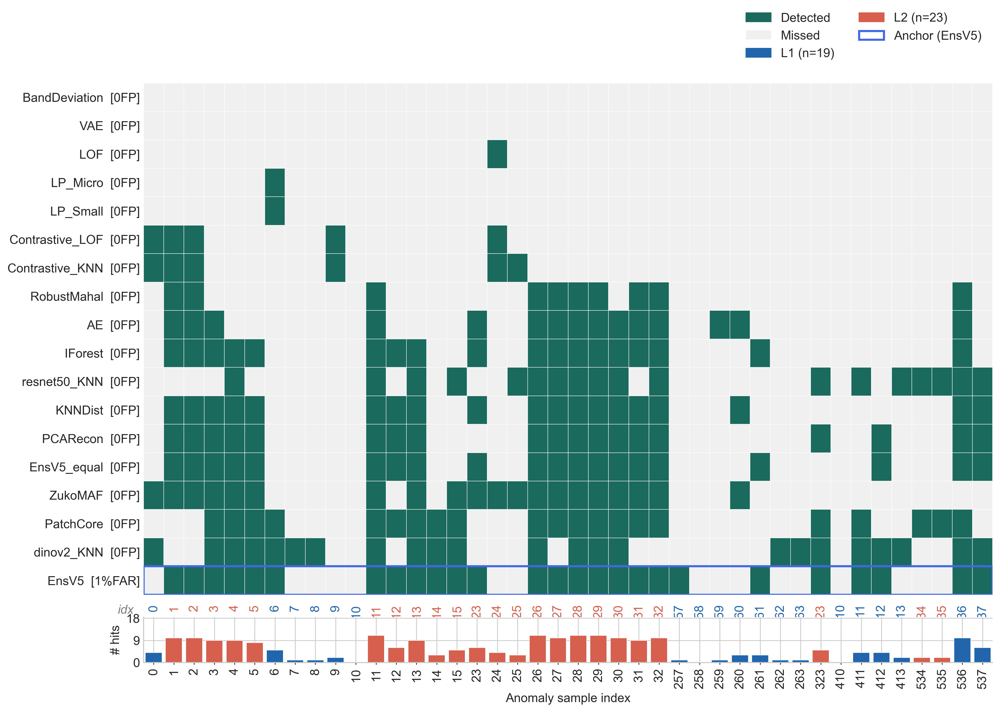

# EMBER

ML for Core Electron Heating due to Wave Modulation in the Solar Wind

## Overview

EMBER uses machine learning to study core electron heating mechanisms driven by coupled electromagnetic wave modulation in the solar wind. The project processes data from NASA's Parker Solar Probe (PSP) FIELDS instrument, transforming burst-mode electric field measurements into spectrograms suitable for training ML models to detect coupled waves.

## Results

EMBER's multi-detector pipeline is evaluated on Parker Solar Probe burst spectrograms
(497 background, 42 anomalies across two physical classes).
Detectors are trained on background-only data and calibrated on a held-out background set (99 samples) at a 1 % false-alarm rate.

### Detection map

The figure below shows which anomalies each detector recovers at the 1 % FAR operating point. Columns are individual anomaly events (blue = Label 1, red = Label 2); rows are detectors ordered by sensitivity. The bar chart shows the number of detectors that flag each event.



The ensemble (EnsV5) and its zero-extra-FP union with secondary detectors collectively recover the majority of events while keeping the false-alarm budget fixed at 1 FP per 99 held-out background samples.

## Data

Parker Solar Probe FIELDS DBM (Digital Burst Memory) burst data comes in two forms:

- **DVAC**: Differential voltage between two opposing antennas (antenna pairs 1-2 or 3-4). This is the preferred data product as it is already processed into differential form.
- **VAC**: Single-ended voltages from individual antennas (vac1, vac2, vac3, vac4). VAC data must be converted to differential voltage before use (e.g., `dvac12 = vac1 - vac2`).

PSP has four antennas mounted at the corners of its heat shield, arranged diagonally — antennas 1 and 2 are opposite each other, as are antennas 3 and 4.

### Data Sources

- Berkeley SSL: https://research.ssl.berkeley.edu/data/psp/data/sci/fields/l2/
- NASA CDAWeb: https://cdaweb.gsfc.nasa.gov/sp_phys/data/psp/fields/l2/

Data is stored in CDF (Common Data Format) files. Each file contains multiple burst datasets, typically with 524,288 samples per burst.

## Processing Pipeline

1. Load CDF files using `cdflib`
2. Extract voltage data (DVAC directly, or compute differential from VAC)
3. Convert TT2000 timestamps to UTC
4. Compute spectrograms using FFT (1024-point Hann window)
5. Apply logarithmic scaling to both frequency and power axes — this is critical for observing coupled wave structures
6. Label and package spectrograms for ML training

## Scripts

- `scripts/download_data.py` — Download CDF files from NASA CDAWeb for specified dates and data products
- `scripts/create_spectrograms_dvac.py` — Process DVAC CDF files into spectrograms
- `scripts/create_spectrograms_vac.py` — Process VAC CDF files into spectrograms (computes differential voltage from single-ended measurements)

## Installation

```bash
pip install -e .
```

For development (includes test dependencies):

```bash
pip install -e .[dev]
```

For anomaly-detection work:

```bash
pip install -e .[anomaly]
```

### Dependencies

- `cdflib` — Reading CDF files
- `numpy` — Numerical operations
- `scipy` — Spectrogram computation
- `matplotlib` — Visualization
and more!

## Package API

### Downloads

```python
from ember.download import build_url, build_filename, build_download_plan, download_products
```

### Spectrogram generation

```python
from ember.spectrograms import (
    iter_spectrogram_records,
    create_dvac_spectrograms,
    create_vac_spectrograms,
    plot_spectrogram,
)
```

### Labeled dataset helpers

```python
from ember.datasets import load_labeled_spectrogram_dataframe
```

### Anomaly detection

#### Robust deployment pipeline (background-only, production mode)

```python
import ember.anomaly as ad

# Load a labeled spectrogram DataFrame
df = ember.load_labeled_spectrogram_dataframe("batchspec.pkl")

# Build the dataset container
dataset = ad.prepare_anomaly_dataset(df)

# Run the full background-only pipeline in one call
results = ad.run_robust_anomaly_pipeline(
    dataset,
    target_far=0.01,          # 1% false-alarm budget
    include_patchcore=True,   # optional: WideResNet-50 patch KNN detector
    include_vae=True,         # optional: β-VAE ELBO detector
    output_dir="./results",   # saves CSVs + PNGs automatically
)

print(results["results_df"])  # AUC, TPR@FAR summary table

# Score new (unlabelled) spectrograms
flags = ad.predict(results, new_specs)   # True = anomaly alert
```

The pipeline trains entirely on background noise, calibrates a score threshold on
held-out background (no label leakage), then optimises ensemble weights by
`scipy.differential_evolution` to maximise TPR at the given FAR budget.

#### Research / LOO-CV workflow

```python
from ember.anomaly import (
    build_feature_bank,
    prepare_anomaly_dataset,
    run_classical_anomaly_workflow,
    run_default_case_analysis,
    summarize_feature_discrimination,
)
```

#### Individual components

| Module | Contents |
|---|---|
| `ember.anomaly.features` | Physics features, coupling features, `PhysicsAugmenter` |
| `ember.anomaly.detectors` | `LocalPatchDetector`, `BandDeviationDetector`, `fit_detector_suite`, `score_detector_suite` |
| `ember.anomaly.patchcore` | `PatchCoreDetector` — frozen WideResNet-50 patch KNN memory bank |
| `ember.anomaly.classical` | Mahalanobis / one-class / supervised detector helpers, linear probing |
| `ember.anomaly.embeddings` | Pretrained-backbone extraction utilities and UMAP projection helpers |
| `ember.anomaly.ensemble` | Rank, mean, weighted, top-k ensembles; `rank_normalise`; `optimise_ensemble_weights` |
| `ember.anomaly.evaluation` | Bootstrap metrics, FAR thresholding, detector-combination analysis |
| `ember.anomaly.neural` | Autoencoder, β-VAE (`SpectrogramVAE`), lightweight flow, contrastive encoder |
| `ember.anomaly.pipeline` | `run_robust_anomaly_pipeline`, `predict`, and the LOO-CV workflow helpers |
| `ember.anomaly.plotting` | Publication-quality figures: ROC curves, score distributions, spectrogram grids, detector heatmaps |

### Repo/reporting helpers

```python
from ember.reporting import (
    plot_three_class_examples,
    plot_case_recovery_summary,
    plot_detection_map,
    plot_feature_discrimination,
    save_repo_figures,
)
```

## Command-Line Entry Points

```bash
ember-download --kind dvac --date 2020-09-25 --hour 06
ember-download --kind vac --date 2021-08-08 --all-hours

ember-spectrograms-dvac data/psp_fld_l2_dfb_dbm_dvac_2020092506_v02.cdf --output output/dvac/
ember-spectrograms-vac data/psp_fld_l2_dfb_dbm_vac_2021080818_v02.cdf --output output/vac/
```

The legacy `scripts/*.py` files still work, but they are now thin wrappers around the packaged `ember` modules.

### Alternative Usage

```bash
# Download a single DVAC file (6-hour block starting at 06 UTC)
python scripts/download_data.py --kind dvac --date 2020-09-25 --hour 06

# Download all 6-hour blocks for a day
python scripts/download_data.py --kind vac --date 2021-08-08 --all-hours

# Download a date range
python scripts/download_data.py --kind dvac --start 2020-09-25 --end 2020-09-27

# Generate spectrograms from DVAC data
python scripts/create_spectrograms_dvac.py data/psp_fld_l2_dfb_dbm_dvac_2020092506_v02.cdf --output output/dvac/

# Generate spectrograms from VAC data
python scripts/create_spectrograms_vac.py data/psp_fld_l2_dfb_dbm_vac_2021080818_v02.cdf --output output/vac/
```
 
```bash
# Anomaly Detectiion Demo
python scripts/anomaly_api_demo.py ../batch4log_spec_coupledwaves.pkl --quick

# Full strict anomaly study bundle for paper-style outputs
python scripts/run_anomaly_paper_study.py ../batch4log_spec_coupledwaves.pkl --output-dir artifacts/batch4_paper_bundle
```